# 13-ORM
# Homework 13 - Object-Relational Mapping (ORM) E-Commerce Back End


## Description 📰
```md
This application provides a backend to an ecommerce site. It will allow for related data to be Created/Read/Updated/Deleted (CRUD) from a backend database.

TECHNICAL DEATAILS
The user can Create/Read/Update/Delete data in all three ecommerce related tables (Categories, Products, Tags). The application uses Sequelize as an ORM and Express to handle HTTP requests.
```

## Table of Contents 📚
- [Installation](#installation)
- [Usage](#usage)
- [Credits](#credits)
- [License](#license)
- [Badges](#badges)
- [Questions](#questions)
- [Tests](#tests)

## Installation 🚧
```md
The following steps should be used to install:
1. Download Repository from GitHub
2. Install NPM installer (if not already installed)
3. Install dependencies by using command: NPM i
4. You will need to create a .env file off of the root directory with the following:
    1. MYSQL_URI=mysql://<your MySQL id>:<your MySQL password>@localhost:3306/ecommerce_db
5. Copy this .env file to the /seeds directory so you can populate the tables with data
6. Run the SQL script file /db/schema.sql to create your database schema (use CLI or GUI)
7. Populate the tables with data by running: NPM index.js from the /seeds directory
8. Start the Express server by running: node server.js
```

## Usage 🧮
This is a backend application and can be utilized by calling its web services using a tool like Insomnia or Postman.


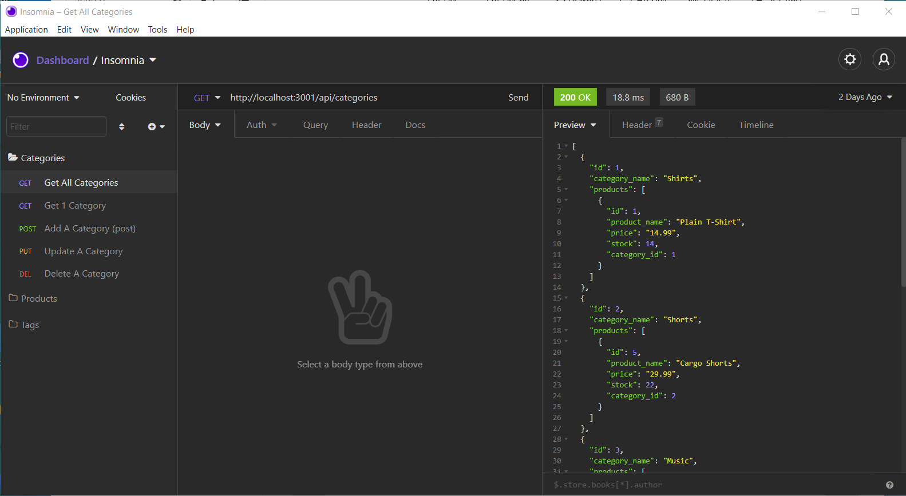
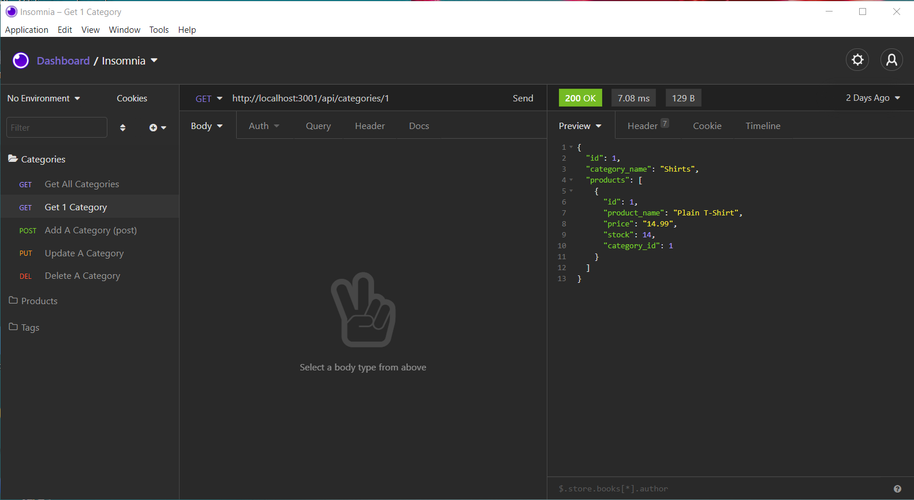
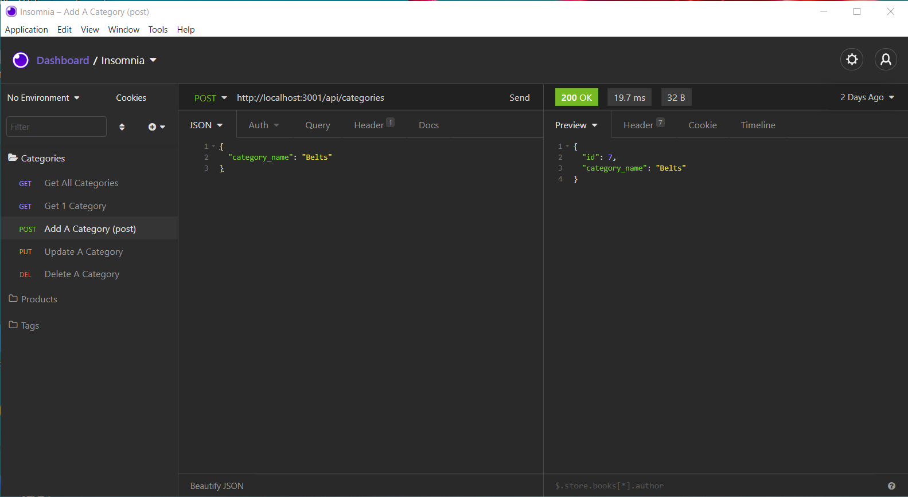
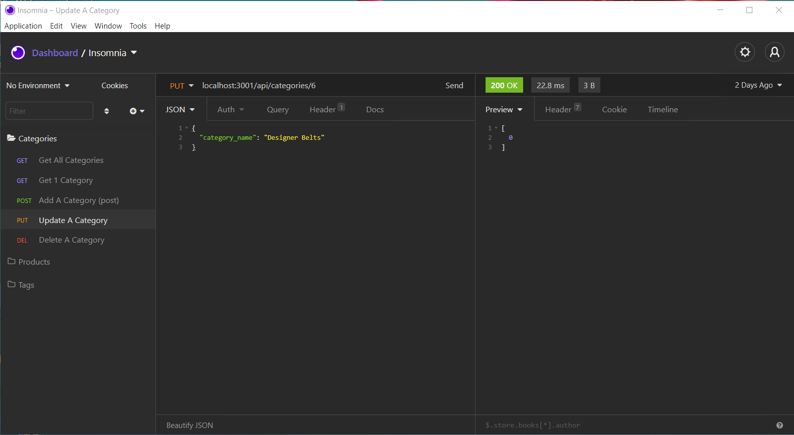
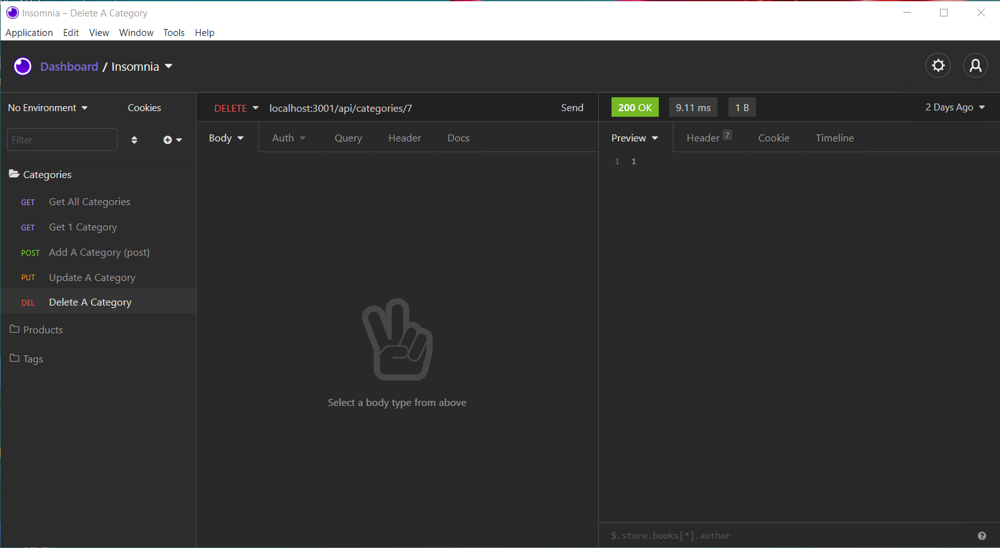

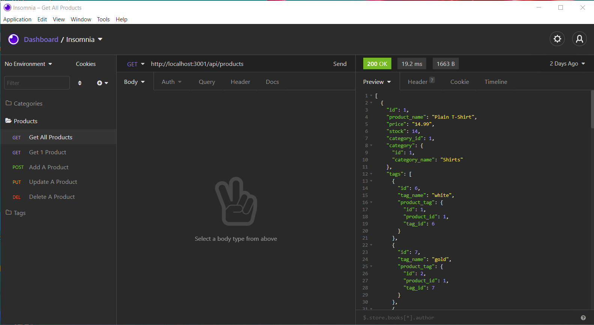

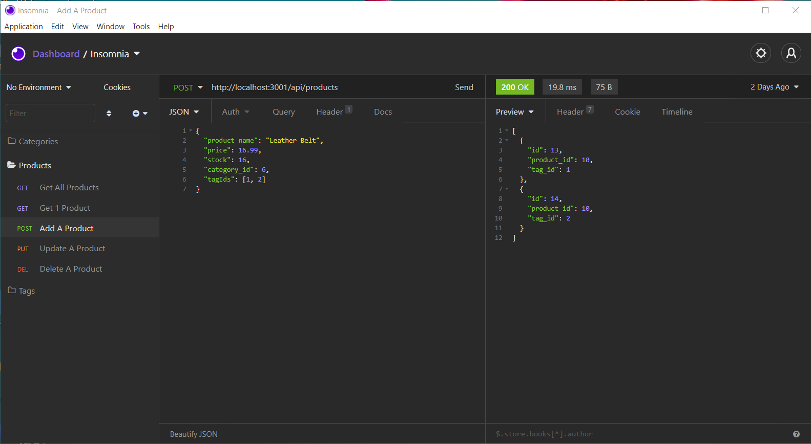
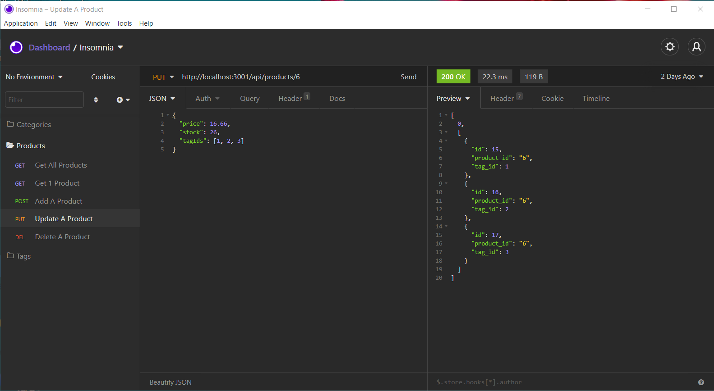
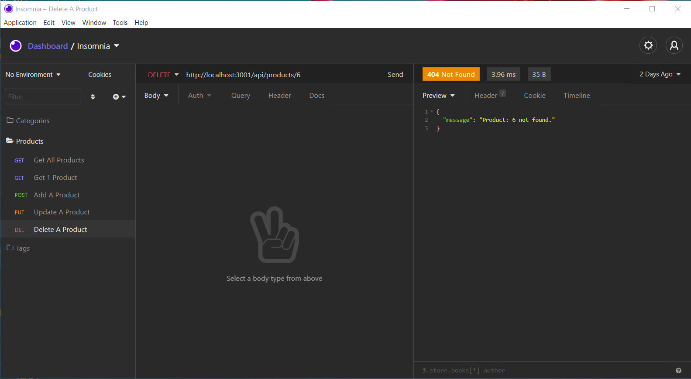

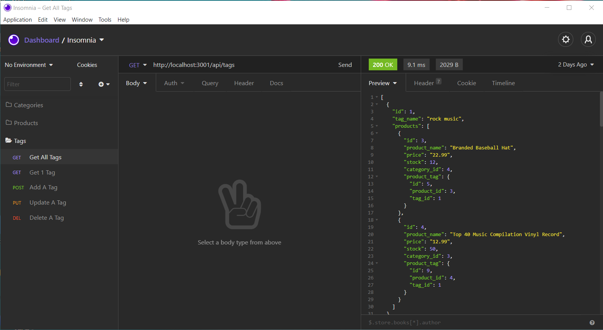
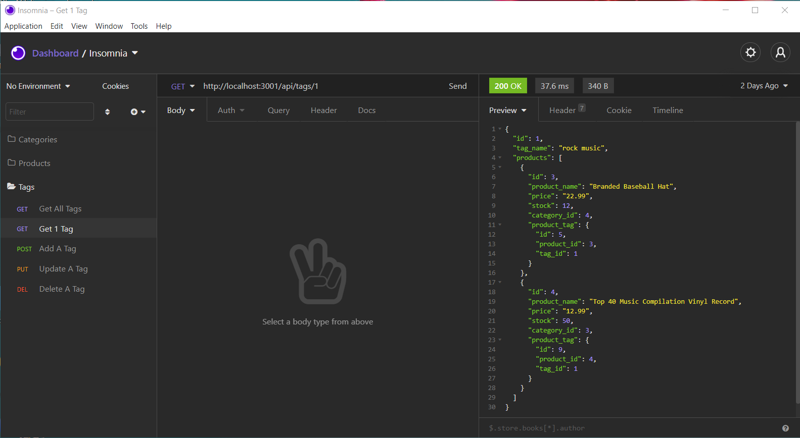
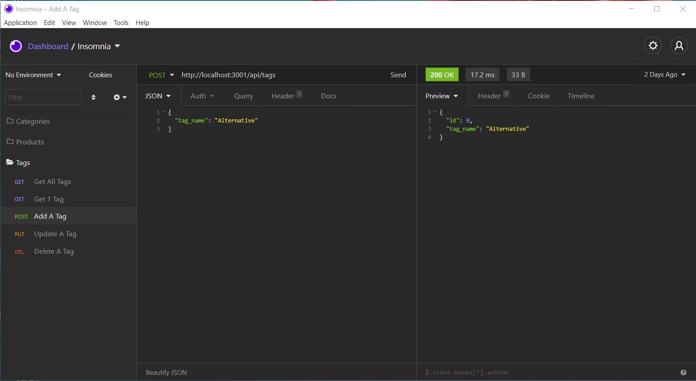
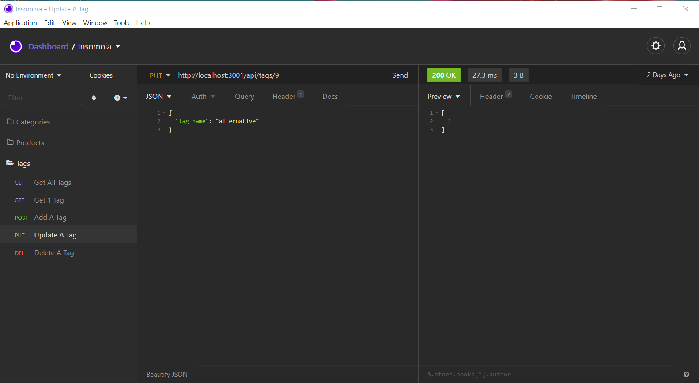
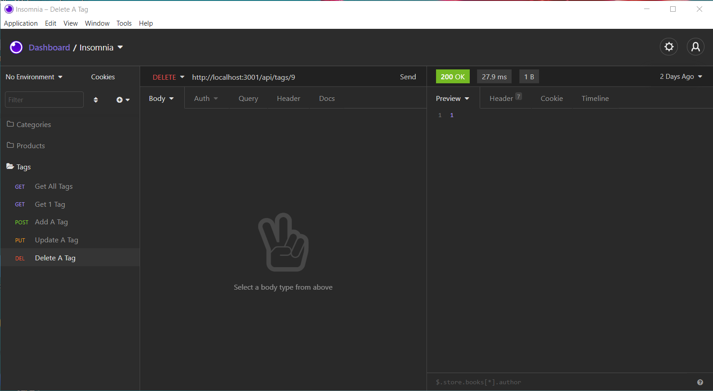

## Credits 👷
```md
Mark Harrison   
```

## License 📜
```md
ISC license
```

## Badges 🛡️
```md


```

## Questions 🔍
```md
:octocat: Follow me on GitHub: [MarkHatTHORinc](https://github.com/MarkHatTHORinc)
✉️ Contact me: markh@thorinc.com
```

## Tests  💻
```md
1. Download GitHub Repostory
2. Using Postman or Insomnia make requests to Get, Post, Put, and Delete each available webservice:
    1. /api/categories
    2. /api/products
    3. /api/tags
3. Using the MySQL CLI or Workbench verify data is being added/updated/deleted.
```

Created by [Generator](_https://github.com/MarkHatTHORinc/09-NodeJS_) using _professional_ template. 
